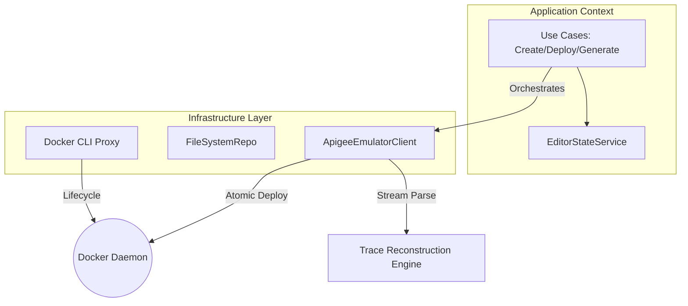
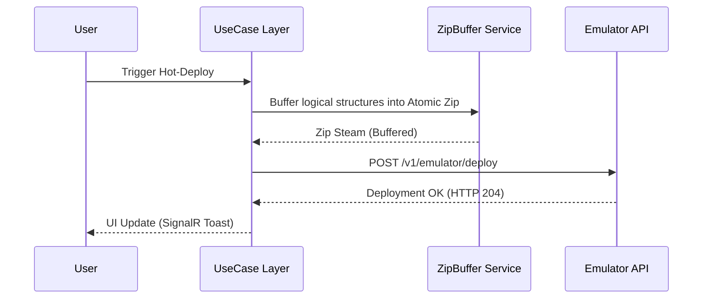

# MVFC.Apigee.Studio — Technical Reference

[](#) 
[](README.pt-BR.md)

**MVFC.Apigee.Studio** is a specialized Integrated Development Environment (IDE) architected for the high-fidelity orchestration of local Apigee environments. This document serves as a deep technical reference for the internal mechanics that power the Studio.

---

## 🏗 Architectural Pillars

The Studio is built on a decoupled, service-oriented architecture designed to handle large-scale Apigee bundles with sub-millisecond responsiveness.

### 1. 📝 The Editor Pipeline (Monaco JS-Interop)
The editor is not just a UI component; it's a managed state-machine built on the Monaco engine:

*   **Multi-Model Isolation**: To prevent state leakage during tab switching, a unique `ITextModel` is maintained per file. This allows for global search/replace and document formatting without loss of navigation history.
*   **Symbol Provider (Real-time AST)**: A custom `DocumentSymbolProvider` utilizes optimized Regex patterns to reconstruct an Abstract Syntax Tree (AST) of the XML in real-time. This powers the interactive Outline view, identifying endpoints, flows, and steps dynamically as the user types.
*   **Persistent Theme Engine**: To survive Blazor's SPA "enhanced navigation," the Studio implements a JS-proxy that re-injects themed CSS rules (`apigee-dark`) and tokenization workers directly into the DOM heap upon every lifecycle re-attachment.

### 2. 🔍 Trace Analytics Engine (Reconstruction Theory)
The engine's primary task is to translate raw, high-cardinality data from the Emulator's Debug API into a stateful transaction lifecycle:

*   **Timestamp Normalization**: The emulator returns timestamps in a non-standard `dd-MM-yy HH:mm:ss:fff` format. The engine converts these into high-resolution epoch milliseconds to calculate discrete execution times per policy point.
*   **ActionResult Mapping**: Raw point data is parsed into `StateChange` (phase transitions), `Condition` (expression yields), and `Execution` (policy enforcement).
*   **Variable Persistence Tracking**: The engine tracks `VariableAssignment` and `header` modification events across the entire pipeline, diffing the request/response state between any two micros-steps.

### 3. 🏗 Gateway Orchestration (Docker & I/O)
The Studio acts as a privileged controller for the local Docker daemon:

*   **Atomic Zip Buffering**: Deployments are handled via a memory-buffered zip compression engine. This ensures that the local gateway receives an atomic, validated bundle, preventing half-deployed states common in manual hot-syncs.
*   **Process Orchestration**: The infrastructure layer wraps the Docker CLI using `ProcessStartInfo` with strict exit-code validation, allowing the Studio to manage container lifecycles (healthz, deployments, and trace sessions) without external dependencies.
*   **Logical structure Mapping**: The `WorkspaceFileSystemRepository` virtualizes flat directories into valid Apigee Logical Structures, automatically identifying `apiproxy` and `sharedflowbundle` types based on internal folder heuristics.

---

## 🛠 Technical Specifications

### Semantic IntelliSense Matrix
| Capability | Implementation Detail |
| :--- | :--- |
| **XML Blueprints** | 20+ Parametric Scaffolds (Security, Mediation, Traffic) |
| **Flow Variables** | Autocomplete for `request.*`, `response.*`, `proxy.*`, `system.*` |
| **Outline Parser** | Real-time Regex-based `DocumentSymbolProvider` |
| **D&D Provider** | `application/vnd.apigee.item` MIME-type interception |

### High-Fidelity Design Tokens
*   **HSL Tokenization**: All visual layers are driven by a curated HSL color system that ensures 4.5:1 contrast ratios even in complex glassmorphism overlays.
*   **Ergonomics**: 44px minimum touch targets across the entire interface (WCAG 2.1 compliance for mobile-first professional usage).

---

## 📂 Core Data Flow



---

## 🔄 Hot-Deployment Lifecycle



---

## ⚡ Deployment & Setup

### Prerequisites
- .NET 10.0 SDK
- Docker Desktop (active)

### Local Spin-up
```bash
git clone https://github.com/Vinicius/MVFC.Apigee.Studio.git
cd src/MVFC.Apigee.Studio.Blazor
dotnet run
```

---

## 📄 License
Apache License 2.0 - Developed with meticulous attention to developer ergonomics.
