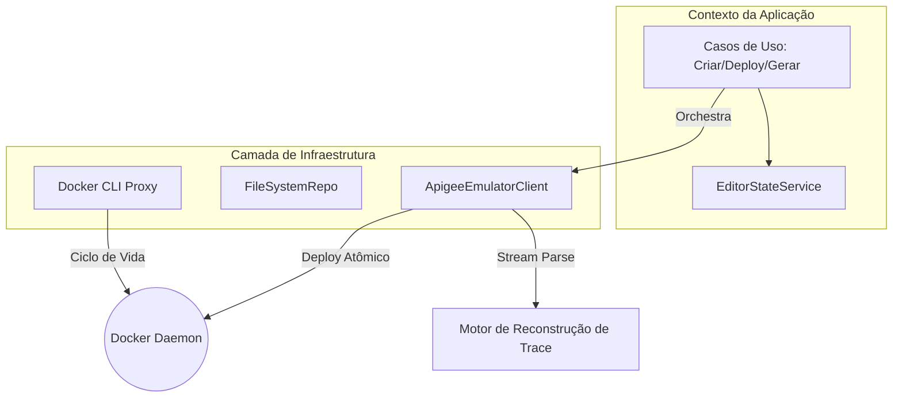
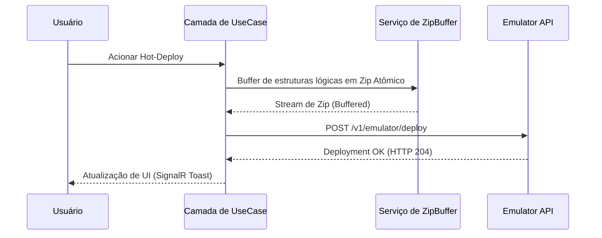

# MVFC.Apigee.Studio — Referência Técnica

[](README.md) 
[](#)

**MVFC.Apigee.Studio** é um Ambiente de Desenvolvimento Integrado (IDE) especializado, arquitetado para a orquestração de alta fidelidade de ambientes Apigee locais. Este documento serve como uma referência técnica profunda sobre a mecânica interna que impulsiona o Studio.

---

## 🏗 Pilares Arquiteturais

O Studio é construído sobre uma arquitetura desacoplada e orientada a serviços, projetada para lidar com bundles Apigee de grande escala com responsividade sub-milisegundo.

### 1. 📝 O Pipeline do Editor (Monaco JS-Interop)
O editor não é apenas um componente de UI; é uma máquina de estados gerenciada construída sobre o motor Monaco:

*   **Isolamento Multi-Model**: Para evitar vazamento de estado durante a troca de abas, um `ITextModel` único é mantido por arquivo. Isso permite busca/substituição global e formatação de documentos sem perda de histórico de navegação.
*   **Symbol Provider (AST em Tempo Real)**: Um `DocumentSymbolProvider` customizado utiliza padrões Regex otimizados para reconstruir uma Árvore de Sintaxe Abstrata (AST) do XML em tempo real. Isso alimenta a visão de Outline interativa, identificando endpoints, fluxos e etapas dinamicamente conforme o usuário digita.
*   **Motor de Temas Persistente**: Para sobreviver à "navegação aprimorada" SPA do Blazor, o Studio implementa um proxy JS que reinjeta regras CSS de tema (`apigee-dark`) e workers de tokenização diretamente no heap do DOM a cada reconexão de ciclo de vida.

### 2. 🔍 Motor de Trace Analytics (Teoria de Reconstrução)
A principal tarefa do motor é traduzir dados brutos e de alta cardinalidade da API de Debug do Emulador em um ciclo de vida de transação com estado:

*   **Normalização de Timestamp**: O emulador retorna timestamps no formato não padrão `dd-MM-yy HH:mm:ss:fff`. O motor os converte em milissegundos epoch de alta resolução para calcular tempos de execução discretos por ponto de política.
*   **Mapeamento de ActionResult**: Dados de pontos brutos são analisados em `StateChange` (transições de fase), `Condition` (resultados de expressão) e `Execution` (aplicação de políticas).
*   **Rastreamento de Persistência de Variáveis**: O motor rastreia eventos de `VariableAssignment` e modificação de `header` em todo o pipeline, comparando o estado de request/response entre quaisquer duas micro-etapas.

### 3. 🏗 Orquestração de Gateway (Docker & I/O)
O Studio atua como um controlador privilegiado para o daemon Docker local:

*   **Buffering Atômico de Zip**: Os deploys são gerenciados via um motor de compressão zip com buffer em memória. Isso garante que o gateway local receba um bundle atômico e validado, evitando estados de "meio-deploy" comuns em hot-syncs manuais.
*   **Orquestração de Processos**: A camada de infraestrutura envolve a CLI do Docker usando `ProcessStartInfo` com validação estrita de código de saída, permitindo que o Studio gerencie o ciclo de vida dos containers (healthz, deploys e sessões de trace) sem dependências externas.
*   **Mapeamento de Estrutura Lógica**: O `WorkspaceFileSystemRepository` virtualiza diretórios planos em Estruturas Lógicas Apigee válidas, identificando automaticamente tipos `apiproxy` e `sharedflowbundle` baseados em heurísticas de pastas internas.

---

## 🛠 Especificações Técnicas

### Matriz de IntelliSense Semântico
| Capacidade | Detalhe de Implementação |
| :--- | :--- |
| **Blueprints XML** | 20+ Scaffolds Paramétricos (Segurança, Mediação, Tráfego) |
| **Variáveis de Fluxo** | Autocomplete para `request.*`, `response.*`, `proxy.*`, `system.*` |
| **Parser de Outline** | `DocumentSymbolProvider` baseado em Regex em tempo real |
| **Provedor de D&D** | Interceptação de MIME-type `application/vnd.apigee.item` |

### Tokens de Design de Alta Fidelidade
*   **Tokenização HSL**: Todas as camadas visuais são guiadas por um sistema de cores HSL curado que garante taxas de contraste de 4.5:1 mesmo em overlays de glassmorphism complexos.
*   **Ergonomia**: Alvos de toque mínimos de 44px em toda a interface (conformidade WCAG 2.1 para uso profissional mobile-first).

---

## 📂 Fluxo de Dados Principal



---

## 🔄 Ciclo de Vida de Hot-Deployment



---

## ⚡ Instalação & Configuração

### Pré-requisitos
- .NET 10.0 SDK
- Docker Desktop (ativo)

### Inicialização Local
```bash
git clone https://github.com/Vinicius/MVFC.Apigee.Studio.git
cd src/MVFC.Apigee.Studio.Blazor
dotnet run
```

---

## 📄 Licença
Apache License 2.0 - Desenvolvido com atenção meticulosa à ergonomia do desenvolvedor.
t:
    ```bash
    dotnet run
    ```

---

## 📄 Licença
Este projeto está licenciado sob a licença MIT - veja o arquivo [LICENSE](LICENSE) para mais detalhes.
